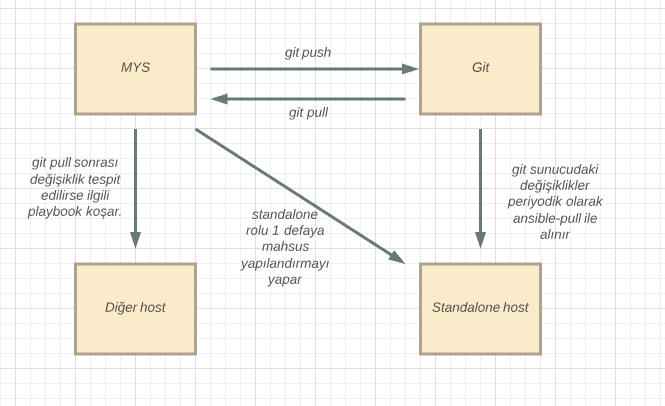

#State-ng Rolü ve Dizaynı
------

State-ng rolü uç sistemlerin yapılandırma değişiklerini git sunucu üzerinden çekmesi ve kendi üzerinde çalıştırması ya da MYS cihazının değişiklileri otomatik bir şekilde uç birimlere aktarabilmesi için kullanılmaktadır.

Bu dökümanda bu rolün dizaynı anlatılmıştır. 

------

* Kurulum dökümanında anlatıldığı gibi bir host state-ng olarak eklendiginde ve playbook calistirildiginda, uç makinaya ansible kurulur. Cron yapılandırması yapılarak makinanın belirli zamanlarda yapılandırma değişiklikleri kontrol edilir. Cron zamanı vars dosyasından ayarlanabilir. 

* Bu yapılandırmanın MYS tarafında her push tarafından tetiklenmesi isteniyorsa aşağıdaki gibi alias tanımlanmalıdır. 

$ **git config alias.xpush '!git push $1 $2 && ansible-playbook/etc/ansible/playbooks/state-ng.yml --tags smarttrigger'**

* Son olarak herhangi bir yapılandırmanın her bir commit sonrası uygulanması için post-commit hookuna aşağıdaki komut eklenir. Bu script MYS cihazına state-ng playbooku tarafından yuklenmektedir.

**/usr/sbin/ahtapot_stateng.py --smart-push** 

* Bu komut playbook tarafından cron a eklenmektedir. İstenildiği taktirde manual olarak da çalıştırılabilir. 

* State-ng playbooku çalıştırıldıtan sonra makinalar aşağıdaki şemaya uygun çalışır. 

**Sayfanın PDF versiyonuna erişmek için [buraya](state-ng-dizayn.pdf) tıklayınız.**
