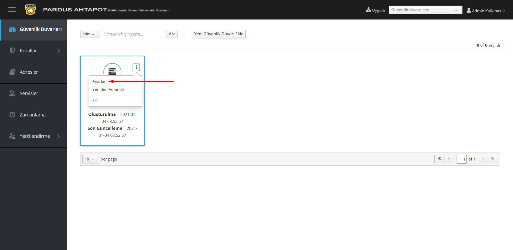
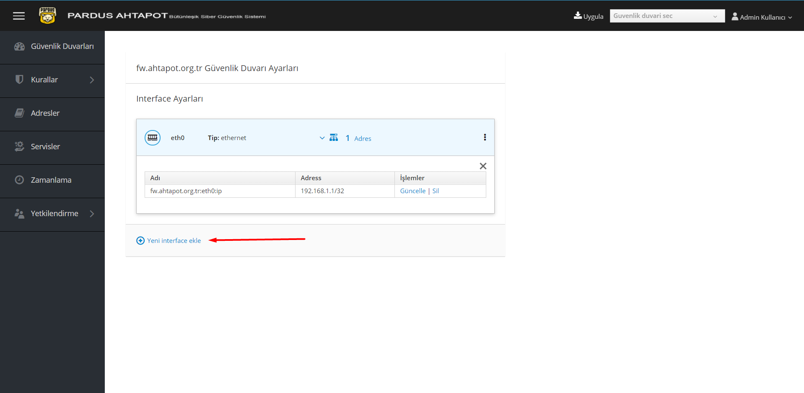
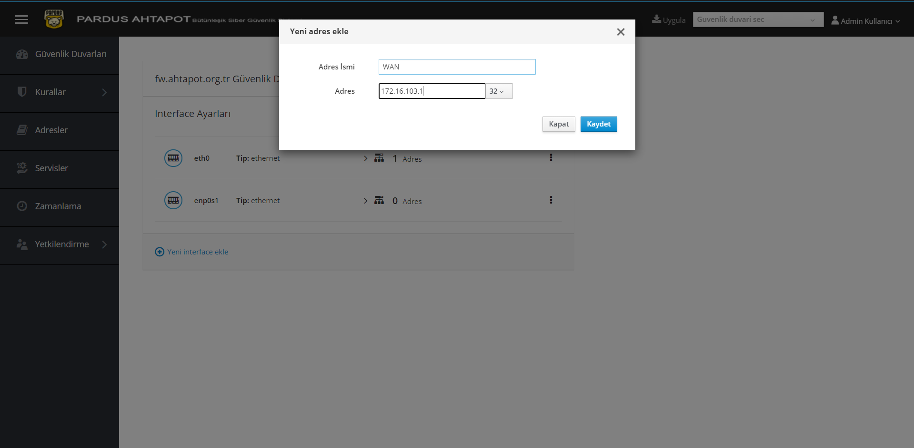

# Güvenlik Duvarı Yönetim Sistemi Kullanımı
------

Bu dokümanda, Ahtapot Güvenlik Duvarı Yönetim Sisteminde güvenlik duvarı yönetimi anlatılıyor.

Gereken : GYDS Entegrasyonu yapılmış Ansible, Gitlab, GDYS2 sunucuları Pardus Temel ISO’ dan kurulumu tamamlanmış bir sunucu / sunucular

#### GDYS Web Yöneticisi üzerinden Güvenlik Duvarı Yönetim Sistemi kullanımı

- Konfigürasyonu yapılmış olan GDYS2 uygulamasında belirtilen host ve port bilgileri kullanılarak tarayıcı üzerinden GDYS2 Web Portalına erişim sağlanır.

- Gelen ekranda konfigürasyon sırasında belirlenene kullanıcı adı şifre değerleri girilerek (Varsayılan: kullanıcı adı: admin, şifre: LA123) ana ekrana erişim sağlanır.

- Ardından ekranda bulunan **Yeni güvenlik duvarı ekle** butonuna basılarak yeni bir güvenlik duvarı eklenilir. Burada Sırasıyla gelen;
  - **Firewall Adı** kısmına firewall'a ait fqdn bilgisi (örn: fw1.ahtapot.org)
  - **Haberleşme arabirimi adı** firewall ile haberleşmede kullanılacak interface bilgisi (örn: eth0)
  - **Haberleşme arabirimi adresi** kısmına haberleşme interfaceine ait ip adresi subnet'i **/32** olacak şekilde yazılır. (örn: 192.168.1.1/32)

- Yeni güvenlik duvarı oluşturulduktan sonra eğer güvenlik duvarı üzerine farklı interface ve ip tanımlamaları yapılmak isteniyorsa, güvenlik duvarı kartının sol üst tarafında bulunan üç noktaya tıklanır ardından **Ayarlar** sekmesine gidilir.

- Bu ekranda daha önce eklemiş olduğunuz arabirim bilgileri ve bu arabirimlere ait adres tanımlamaları yer almaktadır. Arabirim kartı üzerindeki **> (Adres Adeti) Adres** butonuna basılarak arabirim üzerinde bulunan adreslere ait bilgilere görüntülenebilir. Bu adresler dilenirse yanlarında bulunan "**Güncelle**" butonu ile güncellenebilir. Dilenirse yanında bulunan **Sil** butonu ile silinebilir.

- Eğer Güvenlik Duvarı üzerine yeni arabirim eklenmek isteniyorsa en altta bulunan **Yeni interface ekle** butonuna basılır.

- Açılan pencerede arabirime ait bilgiler girilerek kaydet tuşuna basılır. Bu ekrandaki;
  - **Interface ismi** yerine arabirimi ait isim bilgisi girilir. (örn: enp0s1)
  - **Interface Tipi** kısmından eklenen interface'in tipi seçilir.
  - **Yapılandırma arayüzü** bu kısım eğer bu arabirim yapılandırma arabirimi olarak seçilmek isteniyorsa **evet** konumuna getirilmelidir. Bu durum da daha önce **Yapılandırma arayüzü** olarak seçilen arabirimden bu rol kaldırılarak yeni eklenen arabirim üzerine atanacaktır. Eğer yapılandırma arabirimi değiştirilmek istenmiyorsa burası **hayır** konumunda bırakılmalıdır.
  

- Yeni eklenen arabirim üzerine yeni bir adres eklenmek isteniyorsa; aşağıdaki adımlar takip edilerek **yeni adres ekle** butonuna tıklanır.
 

- Daha sonra açılan pencerede eklenecek olan adres için;
  - **Adres İsmi** girilir. (örn: WAN)
  - **Adres** değeri subnet'i **/32** olacak şekilde girilir. Ardından kaydet tuşuna basılır.
 
